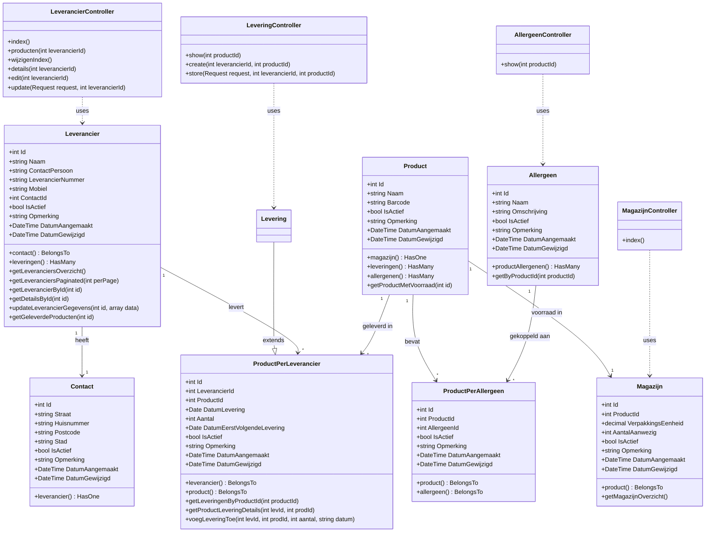

# Class Diagram: BE-opdracht 03 - Jamin

Dit klassendiagram beschrijft de architectuur van het MVC-framework, de Models, Controllers en hun onderlinge relaties.

```mermaid
classDiagram
    class Leverancier {
        +int Id
        +string Naam
        +string ContactPersoon
        +string LeverancierNummer
        +string Mobiel
        +int ContactId
        +bool IsActief
        +string Opmerking
        +DateTime DatumAangemaakt
        +DateTime DatumGewijzigd
        +contact() BelongsTo
        +leveringen() HasMany
        +getLeveranciersOverzicht()
        +getLeveranciersPaginated(int perPage)
        +getLeverancierById(int id)
        +getDetailsById(int id)
        +updateLeverancierGegevens(int id, array data)
        +getGeleverdeProducten(int id)
    }

    class Contact {
        +int Id
        +string Straat
        +string Huisnummer
        +string Postcode
        +string Stad
        +bool IsActief
        +string Opmerking
        +DateTime DatumAangemaakt
        +DateTime DatumGewijzigd
        +leverancier() HasOne
    }

    class Product {
        +int Id
        +string Naam
        +string Barcode
        +bool IsActief
        +string Opmerking
        +DateTime DatumAangemaakt
        +DateTime DatumGewijzigd
        +magazijn() HasOne
        +leveringen() HasMany
        +allergenen() HasMany
        +getProductMetVoorraad(int id)
    }

    class Magazijn {
        +int Id
        +int ProductId
        +decimal VerpakkingsEenheid
        +int AantalAanwezig
        +bool IsActief
        +string Opmerking
        +DateTime DatumAangemaakt
        +DateTime DatumGewijzigd
        +product() BelongsTo
        +getMagazijnOverzicht()
    }

    class ProductPerLeverancier {
        +int Id
        +int LeverancierId
        +int ProductId
        +Date DatumLevering
        +int Aantal
        +Date DatumEerstVolgendeLevering
        +bool IsActief
        +string Opmerking
        +DateTime DatumAangemaakt
        +DateTime DatumGewijzigd
        +leverancier() BelongsTo
        +product() BelongsTo
        +getLeveringenByProductId(int productId)
        +getProductLeveringDetails(int levId, int prodId)
        +voegLeveringToe(int levId, int prodId, int aantal, string datum)
    }

    class Levering {
    }

    class Allergeen {
        +int Id
        +string Naam
        +string Omschrijving
        +bool IsActief
        +string Opmerking
        +DateTime DatumAangemaakt
        +DateTime DatumGewijzigd
        +productAllergenen() HasMany
        +getByProductId(int productId)
    }

    class ProductPerAllergeen {
        +int Id
        +int ProductId
        +int AllergeenId
        +bool IsActief
        +string Opmerking
        +DateTime DatumAangemaakt
        +DateTime DatumGewijzigd
        +product() BelongsTo
        +allergeen() BelongsTo
    }

    class LeverancierController {
        +index()
        +producten(int leverancierId)
        +wijzigenIndex()
        +details(int leverancierId)
        +edit(int leverancierId)
        +update(Request request, int leverancierId)
    }

    class LeveringController {
        +show(int productId)
        +create(int leverancierId, int productId)
        +store(Request request, int leverancierId, int productId)
    }

    class MagazijnController {
        +index()
    }

    class AllergeenController {
        +show(int productId)
    }

    Levering --|> ProductPerLeverancier : extends
    Leverancier "1" --> "1" Contact : heeft
    Leverancier "1" --> "*" ProductPerLeverancier : levert
    Product "1" --> "*" ProductPerLeverancier : geleverd in
    Product "1" --> "1" Magazijn : voorraad in
    Product "1" --> "*" ProductPerAllergeen : bevat
    Allergeen "1" --> "*" ProductPerAllergeen : gekoppeld aan
    LeverancierController ..> Leverancier : uses
    LeveringController ..> Levering : uses
    MagazijnController ..> Magazijn : uses
    AllergeenController ..> Allergeen : uses
```
